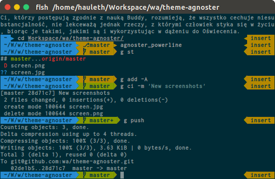

# Fish Agnoster theme

Fancy, colorful theme with support for Powerline fonts.

## Installation

    wa use agnoster

Yeah, really. That's it. Be happy with your fancy new theme.

## Customization

You can change icons used by this theme (given values are defaults):

```
# Segment endings
# AGNOSTER_SEGMENT_SEPARATOR[1] is separator of segment
# AGNOSTER_SEGMENT_SEPARATOR[2] is separator of subsegment
set -g AGNOSTER_SEGMENT_SEPARATOR '' '|'

# Icons
set -g AGNOSTER_ICON_ERROR \u2717 # unicode ballot X (✗)
set -g AGNOSTER_ICON_ROOT \u26a1 # unicode high voltage sign (⚡)
set -g AGNOSTER_ICON_BGJOBS \u2699 # unicode gear (⚙)
set -g AGNOSTER_ICON_GIT_BRANCH \u2387 # unicode alternative key symbol (⎇)
set -g AGNOSTER_ICON_GIT_REF \u27a6 # unicode heavy black curved upwards and rightwards arrow (➦)
```

### Enable PowerLine fonts support

If you have [PowerLine patched font](https://github.com/powerline/fonts) installed
and set for your term then you can use a little bit more fancy theme variant.
To achieve this just add `agnoster_powerline` to your `.dotfiles/init.fish`.

Neat!

## Screenshot



## Licence

MIT
